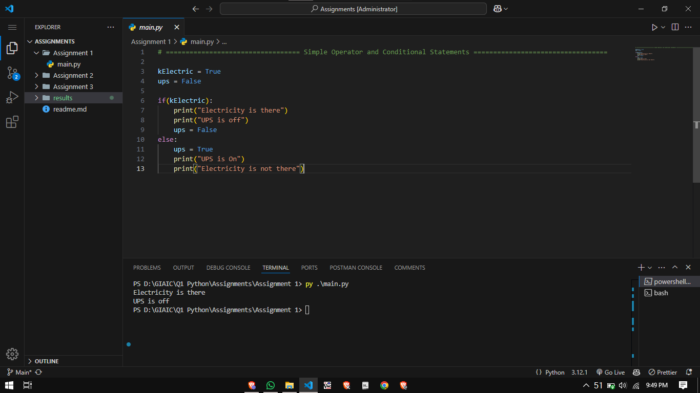
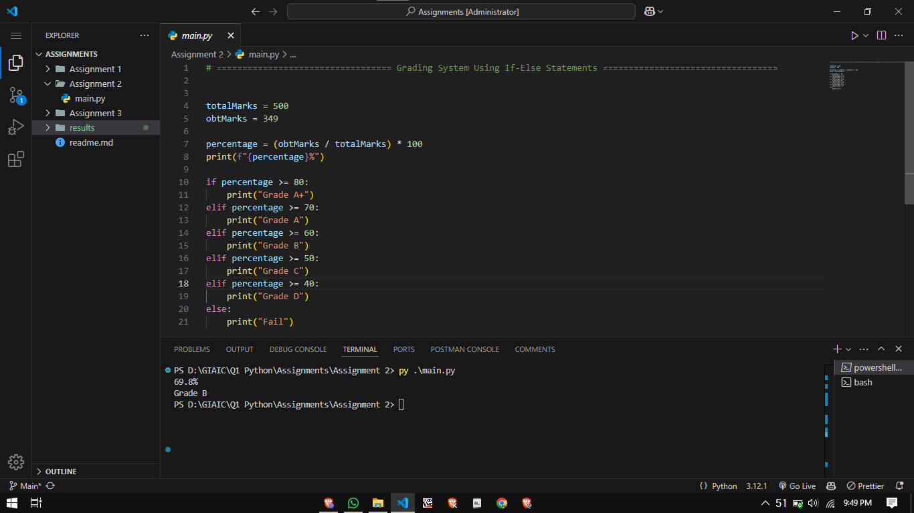
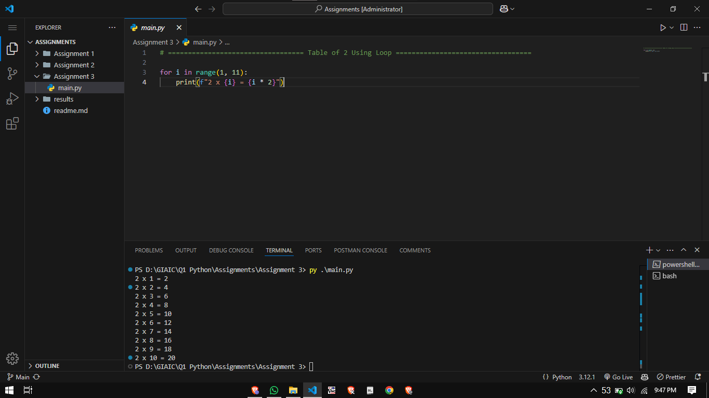

# Assignments

## Assignment 1 

### Use Operators and Make Condition if u have electric ups off else ups on
### Result: 

## Assignment 2

### Grading System Using If Else
### Result: 

## Assignment 3

### Table of 2 using for loop
### Result: 
